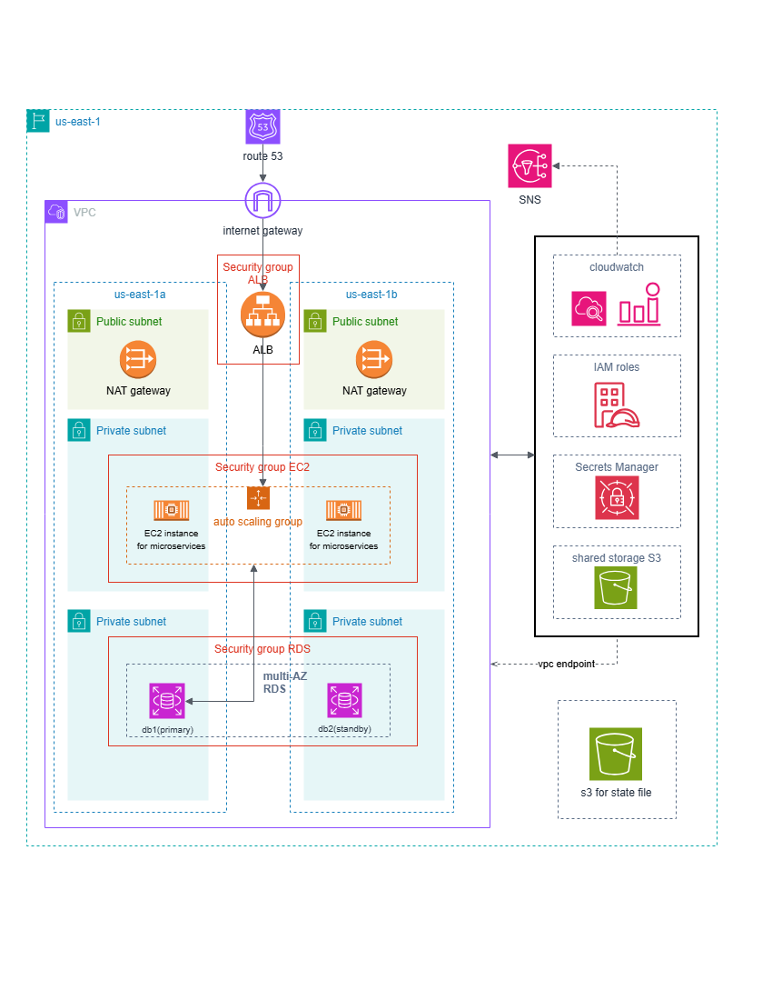

# my-aws-migration

A production-style AWS cloud environment for an application with 8 microservices and a managed database. Infrastructure is defined with Terraform and deployed via GitHub Actions CI/CD pipelines.

## Architecture Overview

The infrastructure runs across two availability zones (`us-east-1a` and `us-east-1b`) inside a VPC with the following layout:

- **Route 53** handles DNS routing into the VPC via an Internet Gateway
- **Application Load Balancer (ALB)** distributes traffic across availability zones
- **Public Subnets** — NAT Gateways in each AZ for outbound internet access from private resources
- **Private Subnets (EC2)** — Auto Scaling Group of EC2 instances running the 8 microservices, protected by a dedicated Security Group
- **Private Subnets (RDS)** — Multi-AZ RDS deployment with a primary (`db1`) and standby (`db2`) instance, protected by a separate Security Group
- **Supporting Services** (accessed via VPC Endpoint):
  - CloudWatch — monitoring and logging
  - IAM Roles — access control
  - Secrets Manager — secure credential storage
  - S3 — shared storage

---

## Architecture



---

## Prerequisites

Before running or deploying this project, ensure you have the following installed.

### AWS CLI

Used to authenticate and manage AWS resources:

```bash
aws configure
```

You will need:
- AWS Access Key ID
- AWS Secret Access Key
- Default region (e.g., `us-east-1`)
- Output format (`json`)

### Terraform

Used to define and deploy infrastructure as code:

```bash
terraform -version
```

Recommended version: **1.5+**  
Download: https://developer.hashicorp.com/terraform/downloads

### Git

```bash
git --version
```

### GitHub Actions Setup

This project uses **GitHub OIDC** to authenticate with AWS — no long-lived access keys are stored as secrets.

#### 1. Create an OIDC Identity Provider in AWS

In the AWS Console go to **IAM → Identity Providers → Add Provider**:

- Provider type: `OpenID Connect`
- Provider URL: `https://token.actions.githubusercontent.com`
- Audience: `sts.amazonaws.com`

#### 2. Create an IAM Role for GitHub Actions

Create an IAM role with the following trust policy (replace the placeholders):

```json
{
  "Version": "2012-10-17",
  "Statement": [
    {
      "Effect": "Allow",
      "Principal": {
        "Federated": "arn:aws:iam::<ACCOUNT_ID>:oidc-provider/token.actions.githubusercontent.com"
      },
      "Action": "sts:AssumeRoleWithWebIdentity",
      "Condition": {
        "StringLike": {
          "token.actions.githubusercontent.com:sub": "repo:<YOUR_GITHUB_ORG>/<YOUR_REPO>:*"
        },
        "StringEquals": {
          "token.actions.githubusercontent.com:aud": "sts.amazonaws.com"
        }
      }
    }
  ]
}
```

Attach a policy to this role with the minimum permissions needed for `terraform plan` (EC2, RDS, VPC read access).

#### 3. Add repository secrets

Add the following under **Settings → Secrets and variables → Actions**:

| Secret/variable | Description |
|---|---|
| `AWS_ROLE_ARN` | ARN of the IAM role created above (e.g., `arn:aws:iam::123456789012:role/github-actions-role`) |
| `AWS_REGION` | Target AWS region (e.g., `us-east-1`) |
| `TF_VAR_db_USERNAME` | Username of the database |
| `TF_VAR_DB_PASSWORD` | Password of the database |

---

## Project Structure

```
my-aws-migration/
├── architecture.png          # Stage 1 deliverable
├── README.md                 # Setup and deployment guide
├── terraform/                # All infrastructure code
│   ├── main.tf
│   ├── variables.tf
│   ├── outputs.tf
│   └── modules/              # VPC, EC2, RDS, ALB, IAM
└── .github/
    └── workflows/
        ├── ci.yml            # Build & test pipeline
        └── cd.yml            # Deployment workflow (no apply)
```

---

## Running Terraform Locally

### 1. Clone the repository

```bash
git clone <repo-url>
cd my-aws-migration/terraform
```

### 2. create terraform.tfvars

Create the Terraform environmental variables file:

```bash
# terraform.tfvars
db_username = "<USERNAME_OF_DB>"
db_password = "<PASSOWORD_OF_DB>"
```

### 3. Initialize Terraform

Downloads required providers and modules:

```bash
terraform init
```

### 4. Validate configuration

Checks syntax and correctness:

```bash
terraform validate
```

### 5. Run Terraform plan

Preview infrastructure changes before any deployment:

```bash
terraform plan
```

---

## CI/CD Pipelines

### CI Pipeline (`ci.yml`)

Triggers automatically on:
- Every push to **any branch**
- Every pull request targeting the `main` branch

Responsibilities:
- Terraform formatting check (`terraform fmt -check`)
- Terraform validation (`terraform validate`)
- Terraform best practices linting (`tflint`)
- Security scan for hardcoded secrets and misconfigurations (`checkov`)
- Runs `terraform plan` and posts the output as a PR comment(when doing a pull request)
- Authenticates with AWS via GitHub OIDC

### CD Pipeline (`cd.yml`)

Triggers on:
- Merges into the `main` branch

Responsibilities:
- Runs `terraform init` and `terraform plan -out=tfplan`
- Uploads the plan file as a GitHub Actions artifact for review
- Posts a summary to the GitHub Actions job summary page
- Authenticates with AWS via GitHub OIDC

> **Note:** The CD pipeline does **not** automatically apply infrastructure changes.

---

## Summary

This project demonstrates an AWS microservices architecture using:

- **Infrastructure as Code** — Terraform with reusable modules
- **Modular cloud design** — separate modules for VPC, EC2, RDS, ALB, and IAM
- **Secure network segmentation** — microservices and database in isolated private subnets
- **CI/CD automation** — GitHub Actions for continuous integration and deployment

